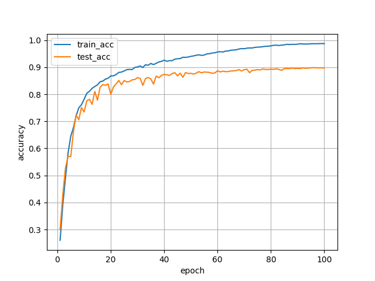
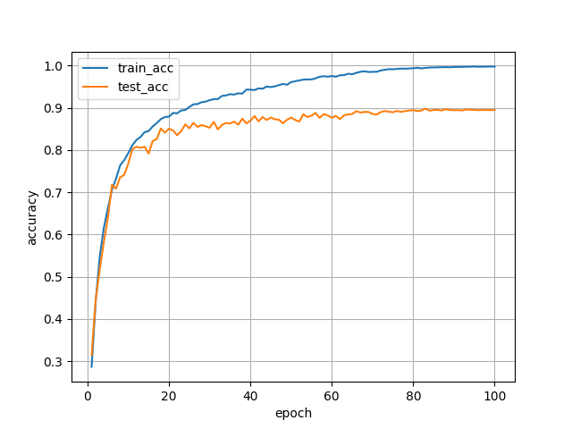
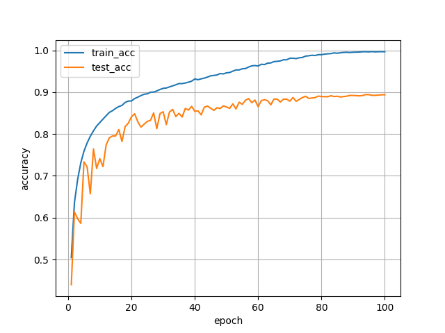
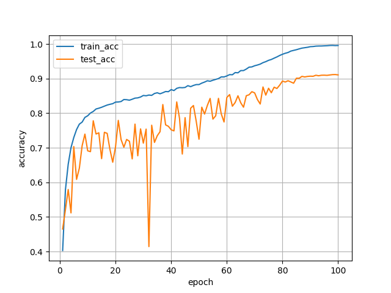
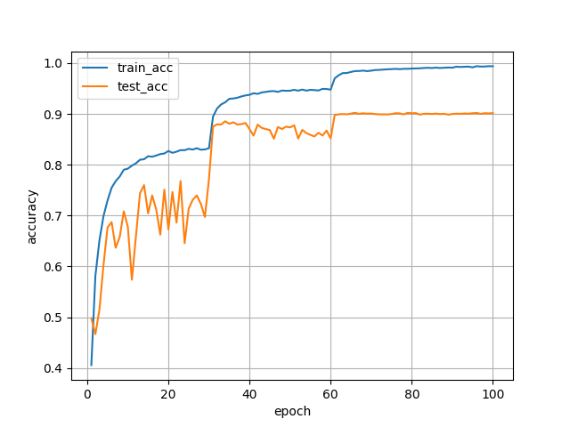
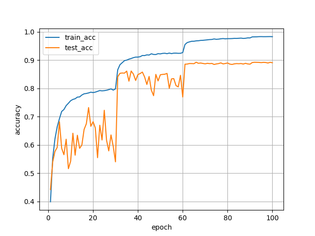

# CIFAR-10 训练作业报告

> 姓名：田希尧
> 学号：2500017415
> 日期：2026-04-22

## 一、实现细节

- 代码位置：训练代码位于 `cifar10_cnn.py`，添加了并行计算训练的 DDP 支持、AMP、DistributedSampler、spawn 数据加载等增强。
- 并行策略：支持三种模式（`off` / `auto` / `ddp`），本次训练中均使用的是 `ddp` 模式，通过 `torchrun` 启动。
- 混合精度：使用 `torch.amp`（`autocast` + `GradScaler`）实现半精度训练以提高吞吐量。
- 数据加载：使用 `torch.multiprocessing.set_start_method('spawn')`，`DataLoader(..., multiprocessing_context='spawn', persistent_workers=True)`，在 DDP 下使用 `DistributedSampler`。
- 检查点与日志：rank-aware 的日志与检查点，只有主进程（rank 0）写入文件系统；增加了保存模型的 helper (`get_model_state_dict`/`load_model_state_dict`) 来兼容 DataParallel/DDP。

## 二、训练环境说明

- 本次训练z在本地使用 `conda` 作为包管理工具，使用的 `python` 版本是 3.12.0. 具体使用的包依赖见 `requirements.txt`. 训练使用的是 NVIDIA 3090 GPU（8 卡环境），CUDA 版本为 13.0. 
- 快速准备：

  ```bash
  conda create -n CNN_CIFAR python=3.12.0 -y
  conda activate CNN_CIFAR
  pip install -r requirements.txt
  ``` 
- 为了方便配置环境，在提交的文件中还包含了直接使用的 `environment.yml`，可以通过以下命令创建环境：

  ```bash
  conda env create -f environment.yml
  conda activate cnn_cifar_test
  ```

  提交的文件中还包含了 `pixi.toml`，也可以用来安装所需的依赖. 需要注意的是，由于使用的是 PyTorch 2.11，显卡的驱动需要较新，否则无法支持这个版本的 Torch. 在本地环境中，具体的信息是：Driver Version: 580.126.09     CUDA Version: 13.0. 

## 三、模型与超参数说明

- 模型：基于 CIFAR-10 的小型卷积网络（默认结构：conv64-128-256 + fc512），其中每两个卷积层池化一次，最后引入了全局池化（GAP）。我们还训练了混合 CNN+ViT 架构（实现已包含在 `cifar10_cnn.py`），方法是取消 CNN 的全连接线性层，转而将卷积层输出的特征图展平成序列输入给 Vision Transformer 的编码器，然后再做分类。
- 常用参数：
  - `batch-size`：以全局 batch 为单位传入给脚本（脚本在 DDP 下会自动按 `world_size` 分配到每个进程）。
  - `optimizer`：`sgd` 或 `adam`；`adam` 推荐 lr=1e-3 左右；若使用 `adam` 且 lr>1e-2，会输出风险警告。`sgd` 推荐 lr=0.1，并制定 `StepLR` 或 `CosineAnnealingLR` 作为 scheduler。
  - `epochs`：默认是要求的 100 个 epochs，但是两种架构在良好的实现下可以在 ~20 epochs 达到至少 80% 的准确率. 
  - `num-workers`：每个进程推荐 8 workers. 本机是 104 核心的 CPU，所以使用了 16 workers 来充分利用 CPU 资源. 
  - `amp`：默认开启以提升吞吐（可通过 `--no-amp` 关闭）。

## 四、对超参数的控制变量研究（控制变量法）

> 实验目标：评估 `optimizer`（SGD/Adam）、全局 `batch-size`、以及网络结构对训练过程和最终精度的影响

实验设计：固定模型、相同随机种子（本实验取 `seed=42`）与数据增强策略，通过改变单一超参数（其他保持不变）来观察影响。以下为代表性试验（在 8×3090 的多卡环境下以 torchrun 方式运行）：

表 1：试验配置与关键指标汇总

- 网络结构：`cnn-vit_vitl6_vitd256_vith8_vitm512_conv64-64-128-128_fc512`; batch_size=1024; optimizer=adam; lr=0.001; sched=cosine; drop=0.1; seed=42; [日志](logs/hybrid_archcnn-vit_vitl6_vitd256_vith8_vitm512_conv64-64-128-128_fc512_bs1024_optadam_lr0.001_schedcosine_drop0.1_seed42_20260420_184917.log); 准确率图像： [accuracy](figures/hybrid_archcnn-vit_vitl6_vitd256_vith8_vitm512_conv64-64-128-128_fc512_bs1024_optadam_lr0.001_schedcosine_drop0.1_seed42/accuracy.png), [loss](figures/hybrid_archcnn-vit_vitl6_vitd256_vith8_vitm512_conv64-64-128-128_fc512_bs1024_optadam_lr0.001_schedcosine_drop0.1_seed42/loss.png). 最佳 test acc = 0.8984 (epoch 96).

- 网络结构：`cnn-vit_vitl4_vitd256_vith8_vitm512_conv64-128-256_fc512`; batch_size=1024; optimizer=adam; lr=0.001; sched=cosine; drop=0.1; seed=42; [日志](logs/hybrid_archcnn-vit_vitl4_vitd256_vith8_vitm512_conv64-128-256_fc512_bs1024_optadam_lr0.001_schedcosine_drop0.1_seed42_20260420_184337.log); 准确率图像： [accuracy](figures/hybrid_archcnn-vit_vitl4_vitd256_vith8_vitm512_conv64-128-256_fc512_bs1024_optadam_lr0.001_schedcosine_drop0.1_seed42/accuracy.png), [loss](figures/hybrid_archcnn-vit_vitl4_vitd256_vith8_vitm512_conv64-128-256_fc512_bs1024_optadam_lr0.001_schedcosine_drop0.1_seed42/loss.png). 最佳 test acc = 0.8983 (epoch 83).

- 网络结构：
`cnn_conv64-64-128-256_fc512`；batch_size=128；optimizer=adam；lr=0.001；sched=cosine；dropout=0.1；seed=42；[日志](logs/training_20260420_224756.log)；准确率图像： [accuracy](figures/cnn_archcnn_conv64-64-128-256_fc512_bs128_optadam_lr0.001_schedcosine_drop0.1_seed42/accuracy.png), [loss](figures/cnn_archcnn_conv64-64-128-256_fc512_bs128_optadam_lr0.001_schedcosine_drop0.1_seed42/loss.png). 最佳 test acc = 0.8943 (epoch 94).

- 网络结构：`cnn_conv64-64-128-256_fc512`；batch_size=128；optimizer=sgd；lr=0.1；sched=cosine；dropout=0.1；seed=42；[日志](logs/training_20260420_225527.log)；准确率图像： [accuracy](figures/cnn_archcnn_conv64-64-128-256_fc512_bs128_optsgd_lr0.1_schedcosine_drop0.1_seed42/accuracy.png), [loss](figures/cnn_archcnn_conv64-64-128-256_fc512_bs128_optsgd_lr0.1_schedcosine_drop0.1_seed42/loss.png). 最佳 test acc = 0.9118 (epoch 99).

- 网络结构：
`cnn_conv64-64-128-256_fc512`；batch_size=128；optimizer=sgd；lr=0.1；sched=step(30)；gamma=0.12；dropout=0.1；seed=42；[日志](logs/training_20260420_230302.log)；准确率图像： [accuracy](figures/cnn_archcnn_conv64-64-128-256_fc512_bs128_optsgd_lr0.1_schedstep_s30_g0.12_drop0.1_seed42/accuracy.png), [loss](figures/cnn_archcnn_conv64-64-128-256_fc512_bs128_optsgd_lr0.1_schedstep_s30_g0.12_drop0.1_seed42/loss.png). 最佳 test acc = 0.9021 (epoch 66).

- 网络结构：
`cnn_conv64-128-256_fc512`；batch_size=128；optimizer=sgd；lr=0.1；sched=step(30)；gamma=0.12；dropout=0.1；seed=42；[日志](logs/training_20260420_235501.log)；准确率图像： [accuracy](figures/cnn_archcnn_conv64-128-256_fc512_bs128_optsgd_lr0.1_schedstep_s30_g0.12_drop0.1_seed42/accuracy.png), [loss](figures/cnn_archcnn_conv64-128-256_fc512_bs128_optsgd_lr0.1_schedstep_s30_g0.12_drop0.1_seed42/loss.png). 最佳 test acc = 0.8926 (epoch 66).

以下是一些定性的结论：
- 随网络结构的复杂化（CNN 层数增加），测试准确率小幅提升（~1%）；但在 100 epochs 下表现无显著差异；在短程训练（无 warmup）以及小数据集 CIFAR-10 上，复杂的多参数结构（如 ViT）基本没有优势，甚至在某些配置下表现更差（如 ViT-L6）。这是因为 ViT 在小数据集上容易过拟合。此外，CNN-ViT 的参数量大约是原本 CNN 的 6 倍左右，训练时间大幅增加. 
- Adam 优化器在初始阶段收敛更快（前 20 epochs），但在后续阶段表现不如 SGD，最终测试准确率略低于 SGD（约 0.5%）。这可能是因为 Adam 在小数据集上容易过拟合，而 SGD 的学习率衰减策略更适合这种情况。
- 在没有 warmup 时，CosineAnnealingLR 的表现劣于 StepLR，尤其是在 Adam 优化器下。可能是因为 epochs 数较少，Cosine 的学习率衰减过快，导致后期训练效果不佳。
- DataParallel 在多卡环境下对小 per-GPU batch 大幅增加同步与复制开销，表现往往不如单卡或 DDP。这部分没有包含在表格中，因为训练时间极长（每 100 步约 5~10s），且 CPU 利用率较高（通信与复制占比大）。在 DDP 模式下，每 100 步时间下降到 0.5~1s，且 GPU 利用率更均衡。
- DDP + AMP + 合理的 per-GPU batch（如 64–128）能明显提升吞吐，且保持或提升验证精度。
- 学习率过大（例如 Adam lr=0.1）会导致训练不收敛或精度剧降。为节省计算资源，这部分的训练也没有完成。

## 五、code availability

- 本次所有实现已保存于仓库的 `cifar10_cnn.py`。
- 日志与图像位于 `logs/` 和 `figures/` 目录。`model_ckpts/` 目录包含了训练过程中保存的模型检查点，但是不做提交。
